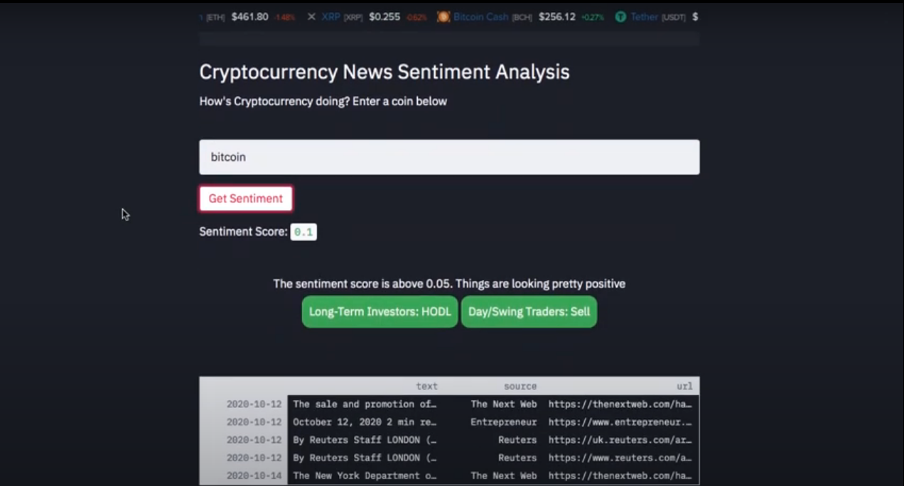
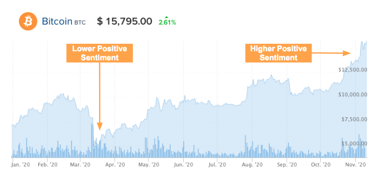
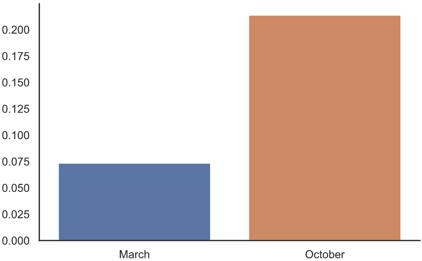
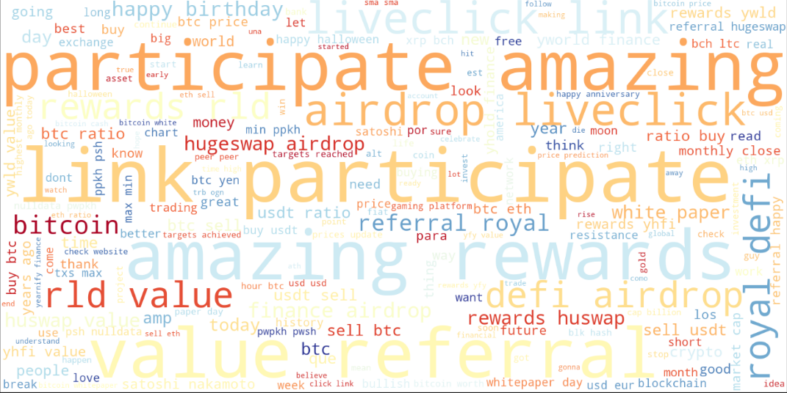

## Project 4: Bitcoin Twitter Sentiment Analysis

### Unsupervised Learning and Natural Language Processing (NLP)

#### Presentation Link: [YouTube](https://youtu.be/EyskhUmbIXg)
#### Streamlit App: [App](https://btcsentiment.herokuapp.com/)

#### Back story:

Focusing on Bitcoin sentiment via Tweets and observing if there is a correlation between a positive/negative sentiment and the price.

 
Whenever the price of Bitcoin increases/decreases, there are a plethora of news articles, Tweets, Telegram chat groups, and etc. projecting that sentiment. "Bitcoin is $17k, BUY BUY BUY" or "Bitcoin is DOOMED!!! SELL!" So in this study we'll attempt to quantify the correlation. For the study itself, we'll focus on two time periods March and October 2020. March 2020 is when the price decreased exponentially and October 2020 is when the price increased exponentially. 

### Learning Goals
1. Utilize Unsupervised Learning Techniques 
2. Create App to display results

#### Skills & Tools

- NLP
    - Text preprocessing
    - Count/TF-IDF Vectorizer
- Unsupervised learning
    - Dimensionality reduction: SVD/PCA
    - Topic modeling: LSA (TruncatedSVD), NMF, LDA, CorEx
    - Sentiment Analysis: TextBlob and Vader Sentiment
- App built using Streamlit and deployed on Heroku

 #### Data Collection and Preprocessing

Using Twitter as the primary data source, all the Tweet links were collected using SNScrape. Then using Tweepy, the links were input into the API and the output was the actual Tweet. Most Tweets have a plethora of hashtags, emojis, random words, too many exclamation marks, etc.So the Tweets needed to be Preprocessed before conducting any sort of Topic Modeling or Sentiment Analysis. 

The following were initially remove: 
- URL's
- Mentions
- Hashtags
- Emojis
- Smileys
- Spefic words etc.

Then a function was written to clean the tweet and apply the following: 
- Lowercasing
- Punctuation Removal
- Replace extra white spaces
- Stopwords removal

#### Sentiment Analysis

With the Tweets cleaned TextBlob sentiment analysis was applied to each Tweet and the output was a Polarity and Subjectivity score. 
- Subjectivity 
    - Score of 0 is fact
    - Score of +1 is very much an opinion 
- Polarity
    - Score of -1 is the highest negative sentiment
    - Score of +1 is the highest positive sentiment

We want to focus on the polarity score here since we are after user's opinion's on Bitcoin. We compare it to the sentiment from March 2020 to October 2020.

#### Topic Modeling

Topic Modeling was completed using NMF, LSA, LDA, and Corex. The topics were analyzed and compared to one another. For March 2020 topics, NMF/LSA were used as they gave the exact same topics.
- Topic 1: Sell Bitcoin
- Topic 2: Price Prediction
- Topic 3: Different Cryptocurrencies

For November 2020, CorEx topic modeling was used to derive the following topics: 
- Topic 1: Buy/Sell 
- Topic 2: Different Cryptocurrencies
- Topic 3: Giveaways
- Topic 4: Bitcoin Whitepaper

#### Conclusion
Utilizing sentiment analysis and topic modeling we were able to see what was most pertinent when it came to Bitcoin Tweets. We were able to observe the sentiment and see what topics were being discussed with, in this case, a higher positive sentiment. There were Tweets about giveaways, buying, and selling. Of course, there was also a topic for Bitcoin Whitepaper's Anniversary on October 31. Overall, this was a good way to observe what people Tweet in regards to Bitcoin, based on their sentiment. 

#### Other
A Word Cloud was created to visualize the most popular words amongst Tweets. An example of the October 2020 wordcloud is shown below. 

#### Sources
- Scraping Twitter: https://github.com/JustAnotherArchivist/snscrape/tree/master/snscrape
- SNScrape + Tweepy: https://medium.com/@jcldinco/downloading-historical-tweets-using-tweet-ids-via-snscrape-and-tweepy-5f4ecbf19032
- Tweet Preprocessing: https://www.kaggle.com/sreejiths0/efficient-tweet-preprocessing
- Sentiment Analysis: https://medium.com/better-programming/twitter-sentiment-analysis-15d8892c0082
